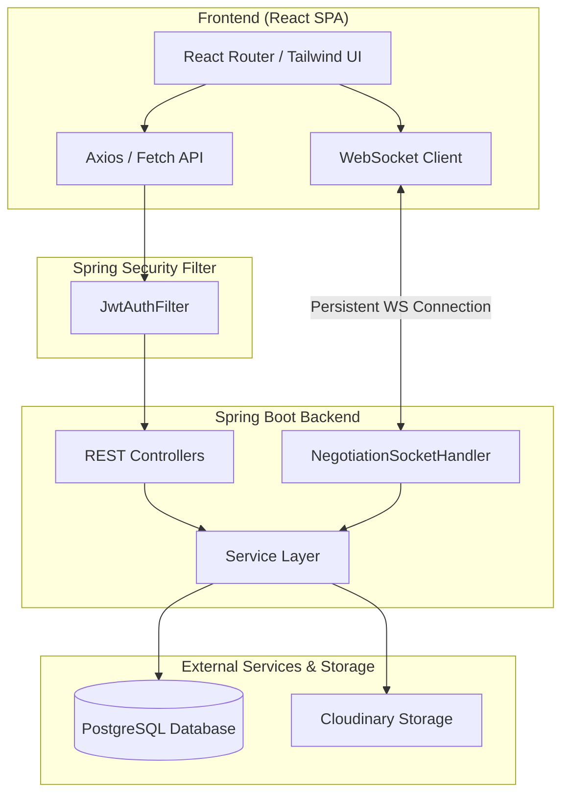

<div align="center">

# 🛒 ExSell

### *Peer-to-Peer Exchange & Sell Marketplace*

A modern, full-stack web application designed for campus and local peer-to-peer commerce. **ExSell** empowers users to sell items, barter products, and negotiate prices in real-time through direct instant messaging.

[](https://spring.io/projects/spring-boot)
[](https://react.dev/)
[](https://tailwindcss.com/)
[](https://www.postgresql.org/)
[](https://cloudinary.com/)
[](https://jwt.io/)

</div>

---

## 📌 Abstract & Overview

Traditional e-commerce platforms focus heavily on fixed-price sales with one-way checkout flows. **ExSell** addresses local and campus marketplace dynamics where buyers and sellers often want to:
* **Negotiate Prices Directly:** Discuss counteroffers in real-time inside dedicated negotiation rooms.
* **Barter & Exchange Items:** Trade items (product-for-product) in addition to conventional monetary transactions.
* **Connect Locally:** Discover listings based on categories, user locations, and item condition.

ExSell combines a high-performance **React + Vite** frontend with a robust **Spring Boot REST & WebSocket** backend, backed by **PostgreSQL** and **Cloudinary** media storage.

---

## ✨ Key Features

- 🛍️ **Catalog & Discovery:** Browse products by categories, search keywords, condition, and price. Filter out your own listings automatically.
- 💬 **Real-Time WebSocket Negotiation:** Bi-directional live chat with custom negotiation messages, role verification (Seller/Buyer), and image attachment support.
- 🔄 **Flexible Transaction Modes:** Support for fixed-price sales, price negotiations, and item bartering/exchange.
- 🛒 **Cart & Wishlist:** Bookmark items for future reference or manage shopping cart selections.
- 🏷️ **Listing Control:** Sellers can manage item availability, mark items as `SOLD_OUT`, or relist them as `ACTIVE`.
- 🔒 **Secure Authentication:** Stateless JSON Web Token (JWT) authorization flow with BCrypt password hashing.
- ☁️ **Cloud Image Hosting:** Multi-image uploads hosted securely via Cloudinary CDN.

---

## 🛠️ Technology Stack

### **Frontend**
- **Framework & Runtime:** React 19, Vite 7
- **Routing:** React Router v7
- **Styling:** Tailwind CSS v3, Lucide React Icons
- **HTTP & Data Handling:** Axios, Fetch API

### **Backend**
- **Core Framework:** Java 17, Spring Boot 3.2
- **Security:** Spring Security, BCrypt, JJWT (Java JWT 0.11.5)
- **Data Access:** Spring Data JPA, Hibernate ORM
- **Real-Time Engine:** Spring WebSocket (`TextWebSocketHandler`)
- **Media Uploads:** Cloudinary SDK

### **Database & Infrastructure**
- **Relational Database:** PostgreSQL
- **Cloud Storage:** Cloudinary CDN

---

## 🏗️ System Architecture



---

## 📂 Project Structure

```
ExSell/
├── backend/
│   ├── src/main/java/com/example/backend/
│   │   ├── config/          # Security, WebSocket, Cloudinary configs
│   │   ├── controller/      # REST API Endpoints (User, Item, Chat, Cart, Wishlist)
│   │   ├── model/           # JPA Entities (User, Item, ChatRoom, ChatMessage, etc.)
│   │   ├── repository/     # Spring Data JPA Repositories
│   │   └── service/        # Business logic services
│   └── pom.xml             # Maven dependencies
│
└── frontend/
    ├── src/
    │   ├── components/     # UI Components (Navbar, Cards, Chat, Forms)
    │   ├── pages/          # Application Pages (Home, Profile, ItemDetails, Messages)
    │   └── App.jsx         # App routes & setup
    └── package.json        # Frontend dependencies
```

---

## 🚀 Getting Started

### Prerequisites
- **Java Development Kit (JDK 17+)**
- **Node.js (v18+) & npm**
- **PostgreSQL Database**
- **Cloudinary Account** (for image upload credentials)

---

### 1. Backend Configuration & Setup

1. **Clone the repository:**
   ```bash
   git clone https://github.com/Sanjay07Kumar/Exchange-Sell.git
   cd Exchange-Sell/backend
   ```

2. **Configure `application.yml` / Database Settings:**
   Update your database credentials and Cloudinary config in `src/main/resources/application.yml`:
   ```yaml
   spring:
     datasource:
       url: jdbc:postgresql://localhost:5432/exsell_db
       username: YOUR_POSTGRES_USERNAME
       password: YOUR_POSTGRES_PASSWORD
     jpa:
       hibernate:
         ddl-auto: update

   app:
     jwt:
       secret: YOUR_JWT_SECRET_KEY

   cloudinary:
     cloud_name: YOUR_CLOUD_NAME
     api_key: YOUR_API_KEY
     api_secret: YOUR_API_SECRET
   ```

3. **Run the Spring Boot application:**
   ```bash
   mvn spring-boot:run
   ```
   The backend server will start at `http://localhost:8080`.

---

### 2. Frontend Setup

1. **Navigate to the frontend directory:**
   ```bash
   cd ../frontend
   ```

2. **Install dependencies:**
   ```bash
   npm install
   ```

3. **Start the development server:**
   ```bash
   npm run dev
   ```
   Open `http://localhost:5173` in your browser.

---

## 📡 REST API Overview

| Category | Endpoint | Method | Access | Description |
| :--- | :--- | :--- | :--- | :--- |
| **Auth** | `/user/register` | `POST` | Public | Register new user account |
| **Auth** | `/user/login` | `POST` | Public | Authenticate user & issue JWT |
| **Auth** | `/user/profile/{id}` | `GET` | Authenticated | Fetch user profile |
| **Items** | `/items/all` | `GET` | Public | Get all active item listings |
| **Items** | `/items/others-items` | `GET` | Public | Get items listed by other users |
| **Items** | `/items/add-items` | `POST` | Authenticated | Create listing with image upload |
| **Items** | `/items/mark-sold/{id}` | `PUT` | Authenticated | Mark listing as sold out |
| **Cart** | `/cart` | `GET` | Authenticated | Fetch active cart items |
| **Wishlist** | `/wishlist/user/{userId}` | `GET` | Authenticated | Fetch user wishlist |
| **Chat** | `/chat/rooms/item/{itemId}` | `POST` | Authenticated | Get or create negotiation room |
| **Chat** | `/chat/rooms/{roomId}/messages` | `GET` | Authenticated | Load chat history |
| **WebSocket** | `ws://localhost:8080/ws/chat` | `WS` | Authenticated | Real-time negotiation socket |

---

## 📄 License

This project is licensed under the MIT License - see the [LICENSE](LICENSE) file for details.
